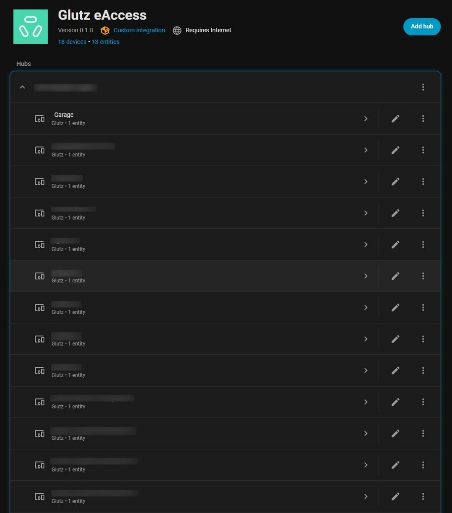
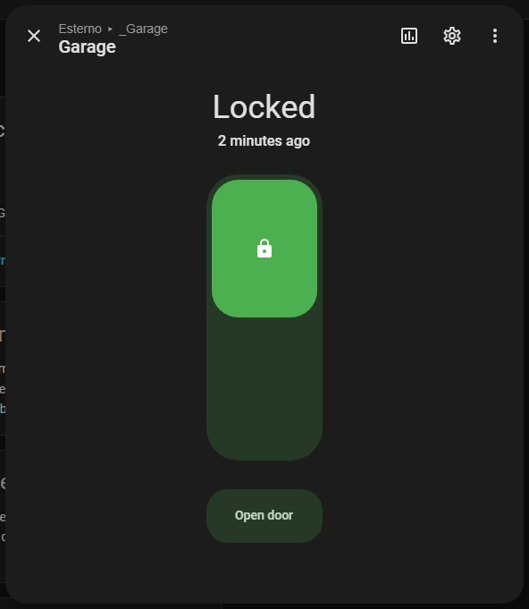
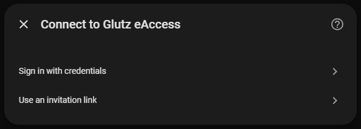
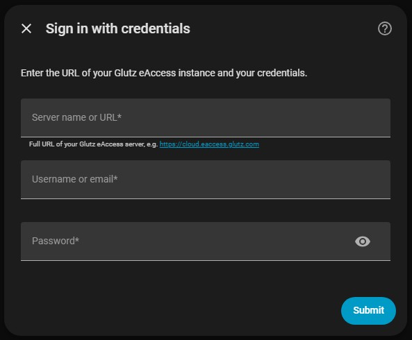
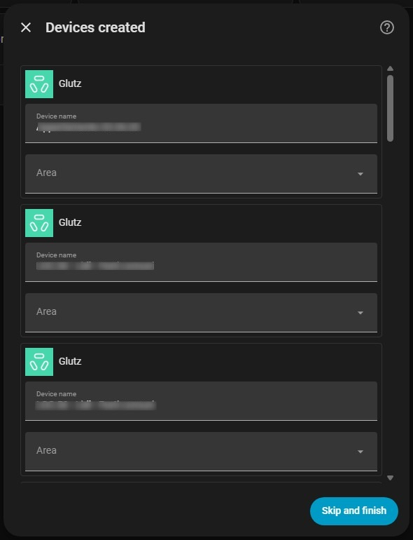

# Glutz eAccess — Home Assistant Integration

A [Home Assistant](https://www.home-assistant.io/) integration for the [Glutz eAccess](https://www.glutz.com/) cloud-based access control system. Control and monitor your Glutz eAccess doors directly from Home Assistant.




> **Status:** this integration is being submitted for inclusion in Home Assistant core. Once merged, it will be available out of the box and this repository may be archived.

## Manual installation (until available in HA core)

Run the following command on your Home Assistant instance:

```sh
wget -O - https://raw.githubusercontent.com/miitchpls/hass-glutz-eaccess/main/install | bash -
```

### Configuration
<a href="https://my.home-assistant.io/redirect/config_flow_start/?domain=glutz_eaccess" target="_blank"></a>







> **Note:** the `pyglutz-eaccess` Python dependency is installed automatically by Home Assistant on first start after installation.

### Running the tests

Use the helper script — it handles everything automatically. On Windows, run it from WSL.

```bash
bash script/test-local.sh
```

To see full setup output:

```bash
bash script/test-local.sh -v
```

Extra pytest flags can be passed after `--`:

```bash
bash script/test-local.sh -- -x                        # stop on first failure
bash script/test-local.sh -- --snapshot-update         # regenerate snapshots
bash script/test-local.sh -- --cov=homeassistant.components.glutz_eaccess --cov-report=term-missing
```


## Documentation

See the [full documentation](./documentation.markdown)

