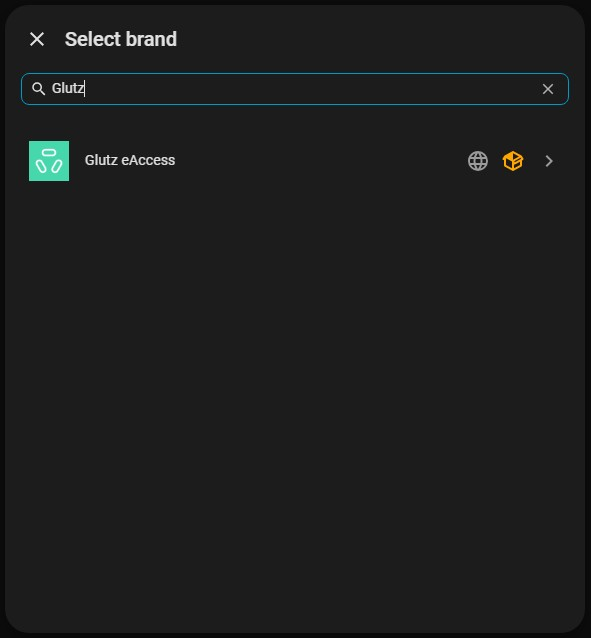

# Glutz eAccess — Home Assistant Integration

A [Home Assistant](https://www.home-assistant.io/) integration for the [Glutz eAccess](https://www.glutz.com/) cloud-based access control system. Control and monitor your Glutz eAccess doors directly from Home Assistant.


> **Status:** this integration is being submitted for inclusion in Home Assistant core. Once merged, it will be available out of the box and this repository may be archived.

## Manual installation (until available in HA core)

1. Download or clone this repository.
2. Copy the `homeassistant/components/glutz_eaccess/` folder into the `custom_components/` directory of your Home Assistant configuration:
   ```
   <config>/custom_components/glutz_eaccess/
   ```
3. Restart Home Assistant.
4. Go to **Settings → Devices & Services → Add Integration**, search for **Glutz eAccess** and follow the setup wizard.




> **Note:** the `pyglutz-eaccess` Python dependency is installed automatically by Home Assistant on first start after installation.

## Documentation

See the [full documentation](./documentation.markdown)

